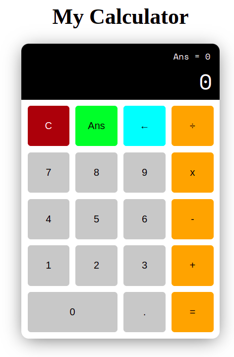
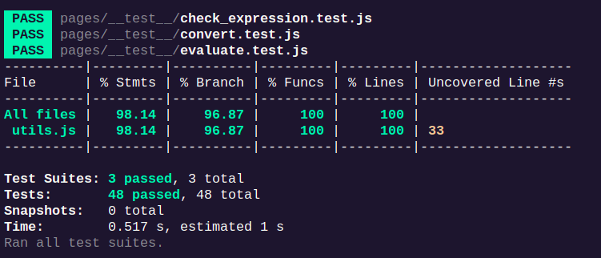

# Frontend Thinking - Calculator project    
## Introduction
This is the project about simple **Calculator** simulation.using `Javascript` programming language, `NodeJS, NextJS and ReactJS` framework and `Jest` library for testing. We can enter the number from keyboard or click directedly into buttons. The function that invoked will illustrate the result on the black screen on top. Apart from it, we can store the previous result from the previous expression that we calculate before.

  

## Getting Started
### Prerequisite
+ `NodeJs` >= 16.15.1
+ `npx` >= 8.11.0
+ `npm` >= 8.11.0
+ `Docker` and `Docker Compose`
### Installation
```bash
git clone https://github.com/nh0znoisung/Calculator.git
cd Calculator/Calculator
```

### Running manually
```bash
cd Calculator
npm run dev
```
Visit [http://localhost:3000](http://localhost:3000)  to access the website.

### Running with Docker
```bash
docker-compose up -d # Make sure Port 3000 is not in use
```
Visit [http://localhost:3000](http://localhost:3000)  to access the website.

### Terminate Docker server
```bash
docker kill calculator
```

### Testing manually
```bash
npm run test # Test normal
# or
npm run test -- --coverage # See the coverage infomation
```

### Testing with docker
```bash
docker exec calculator npm run test # Test normal
# or
docker exec calculator npm run test -- --coverage # See the coverage infomation
```
<!-- 
### Deploying on VPS
Due to this source code have been deployed on `VPS` using `Docker`. We can visit web page at [http://tuanqm.duckdns.org:3000/](http://tuanqm.duckdns.org:3000/). -->

## Mechanism
### UI
This UI contains **19 buttons** including: **10 buttons** for single number from 0 to 9, **a dot button** for float number, **4 operator button** corresponding with plus, minus, multiply, divide, **4 functional buttons** such as `Clear`, `Ans`(Pre-result), `Delete`, `Calculate`.
These button are designed as a grid 5*4.  

### Dashboard
Above of these button is the **screen** that illustrates the result of the expression. Apart of it, the black screen have a little line which stores the **pre-result** of the latest result of a expression.

### Key Press
Instead of clicking into the buttons for invoke the function. It includes:
+ `0,1,2,3,..,9` for clicking number `0,1,2,3,..,9`.
+ **C** or **c** for `clear` function.
+ **A** or **a** for `ans` function.
+ `=` for `calculate` function.
+ `Backspace` for `del` function.
+ `/,*,-,+` for 4 operators.  
+ `.` for dot of float number. 

### Algorithm
The special thing in this project is that we do not use the built-in function `eval()` in **Javascript**. We manually write a algorithm in order to calculate the expression. In this case, we can test about bussiness logic (unit-test).

In this algorithm, we limit the range of functions, such as `**` is exponential operator in `eval()`. We set default some rules for calculating for expression: 

- `/,*` is higher precedence than  `+,-`
- Don't have any more complex operator such as `^,!,- (Unary)` or Parentheses `()` which can change the precedence.
- Accept the float number, `parseFloat()` function we used only accept the first string pattern float if needed and return the float number. For example, `1.1.1231` means `1.1`, `  1.   1`means `1`.


## Testing
In this project, we use `Jest` library for testing in Javascript. We create totally **48 testes** for testing 3 main functions in order to implement `eval()` function. The result is that the coverage that we tested is **98.14%** in `Stmts`, **96.87%** in `Branch`, **100%** in `Functions`, **100%** in `Lines`. 
  